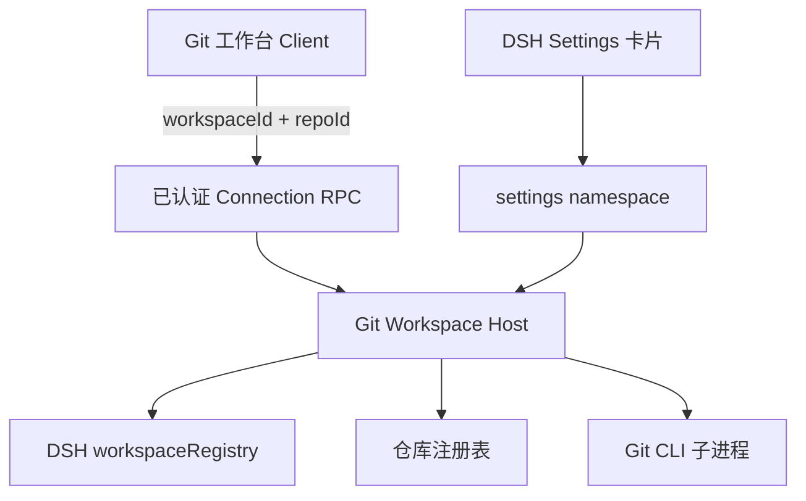
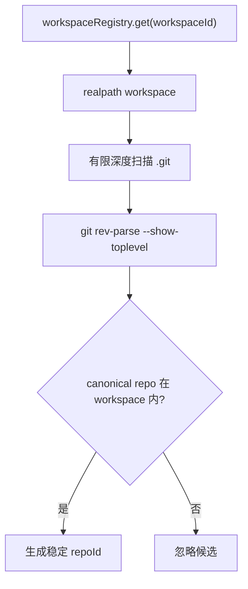

# dsh-git-workspace 设计说明

## 1. 目标

在一个 DSH workspace 内管理多个不同目录下的独立 Git 仓库，同时满足：

- 仓库隔离：所有 Git 命令都明确归属一个 Host 注册的 `repoId`。
- 用户决策可见：暂存、提交、Pull、Push、发布和批量范围都显式。
- DSH 原生体验：复用 DSH workspace、Settings 和会话宿主。
- 网络策略最小化：配置足以表达部分 Remote 走代理，但不把常用设置变成规则引擎。
- 跨平台：Windows、macOS、Linux 不依赖 POSIX shell 引号规则。

非目标：跨仓库原子事务、自动冲突解决、自动 merge/rebase、force push、任意 SSH 命令注入。

## 2. 总体架构



Host 是路径、Git 状态和代理决策的唯一权威。Client 负责范围选择、预检展示和确认，不具备任意文件系统路径执行能力。

## 3. 插件装配

单个 npm 包同时提供：

- `exports["."]` → `lib/index.js`：Host half。
- `exports["./client"]` → `lib/client.js`：Web half。
- `dsh.bundle.patch` → `cordis.patch.yml`：向 profile 插入 `git-workspace`。
- `dsh.client`：声明 Web 平台 client bundle。

因此安装闭环是：

```text
pnpm install → pnpm build → dsh plugin --profile web add ./
```

DSH 官方 CLI 要求 plugin 管理命令显式选择 profile；插件自身无法在安装前提供默认 profile。

## 4. UI 宿主

### 4.1 左侧入口

通过 `sidebar.panellist` 注册列表项，id 为 `dsh-git-workspace`。DSH 负责行布局、按钮、选中状态、折叠图标和可访问名称，插件只贡献图标、中文标签和排序值。

### 4.2 主内容区

通过 root-scoped `main` 注册同名 key；无当前 Session 也能打开。关闭时调用 `ctx.layout.selectPanel(null)`。移除 DOM 锚点、全局 MutationObserver、`dsh-panel-activate` 事件和隐藏宿主会话的样式。

组件挂载与卸载遵循 DSH 原生导航；返回工作台会重新读取注册表。宽度和上次 workspace 选择仍保存在 localStorage，临时详情与批量弹窗属于本次挂载。切换面板不表示撤销已经发出的 Git 请求；重新打开后可刷新仓库状态，不承诺恢复上一轮批量进度弹窗。

主题别名在 `.dgw-view` 和 `.dgw-settings-card` 上声明，从 body 继承 DSH 的 `--dsw-alias-bg-*`、`--dsw-alias-label-*` 和 border 变量。通过 `body[data-ds-dark-theme]` 提供插件状态颜色的深色补充，无需重新挂载或重绘 Diff。

## 5. 仓库发现与信任链



关键规则：

- RPC 不接受绝对 `cwd`。
- `repoId = SHA-256(workspaceId + NUL + canonicalPath)` 的前 20 个十六进制字符。
- 注册表只在 Host 内存保存。
- 每次解析 repo 时再次 `realpath`，路径移动或越界即失败。
- 扫描不跟随符号链接目录。
- `.git` 文件用于识别 worktree/submodule。

## 6. Git 进程模型

`git-process.ts` 使用 Node `spawn`：

```text
spawn("git", args, { shell: false, cwd, env, signal })
```

这使路径、URL、分支名和提交信息保持为独立 argv，不需要 shell 转义。统一环境：

- `GIT_TERMINAL_PROMPT=0`
- `GIT_OPTIONAL_LOCKS=0`
- `LC_ALL=C`

输出总量默认限制 8 MiB，Diff/History 进一步限制 4 MiB。

## 7. Git 状态与操作语义

状态来源：

```text
git status --porcelain=v2 -z --branch --untracked-files=all
```

解析支持普通、rename/copy、unmerged、untracked 和特殊字符路径。

| 操作 | 语义 |
| --- | --- |
| Stage | 只接受当前 status 中的路径 |
| Unstage | `restore --staged`，兼容回退 `reset`/unborn `rm --cached` |
| Commit | `git commit -F -`，staged 为空则拒绝 |
| Checkout | 只切换已枚举本地分支，或从已枚举 Remote 分支显式创建本地跟踪分支；冲突时拒绝 |
| Delete branch | 只用 `branch -d` |
| Fetch | 每个 Remote 分别运行 |
| Pull | 允许无冲突本地修改；`--ff-only --no-rebase --no-autostash` |
| Push | 当前分支到明确 Remote |
| Publish | `push -u`，需要单独确认 |

## 8. Remote 网络策略

### 8.1 Settings 模型

namespace：`dsh-git-workspace`

```ts
interface NetworkSettings {
  proxyUrl?: string              // secret
  proxyHosts?: string[]
  directHosts?: string[]
  blockHosts?: string[]
  defaultAction?: 'inherit' | 'direct' | 'block'
}
```

没有默认“所有 Remote 走代理”，也没有常驻高级规则表。Fetch URL 和每个 Push URL 分别解析协议和 host。

### 8.2 决策

固定 first-class precedence：

1. `blockHosts`
2. `directHosts`
3. `proxyHosts`
4. `defaultAction`

Host 返回给 Client 的 `ProxyDecision` 只包含动作、命中来源、host、无凭据 endpoint 和原因。

### 8.3 进程注入

- `proxy`：使用 `--config-env=http.proxy=DSH_GIT_WORKSPACE_PROXY`，值只在子进程环境。
- `direct`：`-c http.proxy=` 并清空大小写代理环境变量。
- `inherit`：不覆盖 Host 环境。
- `block`：启动 Git 进程前拒绝。

不写全局或仓库 Git config。HTTP proxy 不应用于 SSH；SSH 命中 proxyHosts 时失败关闭。

## 9. RPC

插件通过 `ctx.connection.fetch.register()` 注册 `/api/git-workspace/<endpoint>` 精确 POST 路由。它们复用 Connection 的 Host/Origin 检查、浏览器认证和 buffered 请求体限制，不拦截 Gateway。Client 使用 `connection.rpc.call('/api', 'git-workspace/<endpoint>', payload)`；Host 校验标准请求信封及 URL/body method 一致性，并返回带同一 rpcId 的响应。选用精确路由是因为 DSH 0.1.5-rc.1 的独立 rpc.handle 路径在实际插件上下文中触发 webServer 注入错误；无需修改 DSH 源码。

主要请求：

| 端点 | 关键输入 | 输出 |
| --- | --- | --- |
| `workspaces` | 无 | DSH workspace 列表 |
| `scan` | workspaceId | WorkspaceSnapshot |
| `detail` | workspaceId, repoId | 状态、修改、历史、Remotes |
| `diff` | repoId, path, staged | 文本 Diff |
| `stage/unstage` | repoId, paths | RepositoryDetail |
| `commit` | repoId, message | RepositoryDetail |
| `commit/detail` | repoId, hash | 完整消息、元数据、父提交和变更文件 |
| `commit/diff` | repoId, hash, path | 该提交中已枚举文件的文本 Diff |
| `branch/*` | repoId, branch | Branch/Detail |
| `remote/*` | repoId, name, url | RepositoryDetail |
| `fetch/pull/push/publish` | repoId, remote? | RepositoryDetail |
| `batch` | repoIds, action | BatchResult |

工作区 Diff 仍由 Host 生成统一 patch，但 Client 将其解析为带新旧行号和增删语义的结构化行。普通 `git diff` 不覆盖未跟踪文件，因此 Host 对状态中确认存在的 untracked 普通文件生成等价的 new-file patch；符号链接只读取链接本身，不跟随目标。

Host 业务错误映射到 DSH RPC `internal` envelope，并在 details 中保留 `pluginCode`。独立 channel 仍复用 DSH Connection 的请求校验、取消信号和版本对应的信任/认证栅栏。

## 10. 批量模型


批量操作由 Client 调用现有的单仓库 Fetch/Pull/Push RPC：Fetch/Pull 使用最多 4 个 worker 的有界并发，Push 保持顺序执行。每次返回后立即更新对应行，不等待整个批次结束。执行状态为 `pending → running → success | failed`，预检失败为 `blocked`；某仓库失败不阻止其他仓库，也不回滚已经成功的仓库。保留 Host `batch` 端点用于协议兼容，但 Web 工作台不依赖它展示实时进度。

工作台使用可调整的三栏模型：仓库栏与主操作区、主操作区与详情栏之间各有垂直分隔条；指针拖拽和方向键都可修改宽度。详情栏只在 Diff 或提交详情打开时挂载，宽度偏好写入浏览器 localStorage。批量结果不占用详情栏。

## 11. 刷新与并发

- 工作台首次挂载时读取 workspace；每次打开时立即重新读取，打开期间每 5 秒同步一次。数据始终来自 `workspaceRegistry.list()`，不按 session 数量过滤。
- 当前 workspace 在首次选择或用户点击“刷新工作区并扫描”时扫描。
- 当前仓库详情每 5 秒刷新。
- Git 写操作返回新的完整 RepositoryDetail，客户端立即折叠。
- 任何 mutation 前 Host 再读 status/branch/remote，Client 状态不是授权依据。
- DSH Settings 写入通过 namespace revision fencing；公开 rc.2 scope 是逐字段写入，保存失败时 Host 仍是最终权威。

## 12. UCD 验收场景

### UCD-01：首次发现多个仓库

1. 用户打开 Git 工作台。
2. Host 从当前 DSH workspace 扫描 `repo-a`、`services/repo-b`；即使 workspace 尚无会话，只要已登记在 DSH 中就会出现在选择器。
3. 左栏按相对路径显示两个独立状态。
4. 用户选择仓库时所有 RPC 只携带其 `repoId`。

### UCD-02：安全提交

1. 用户点击 unstaged 文件查看 Diff。
2. 显式 Stage 文件。
3. 输入提交信息。
4. 确认框说明只提交 staged 范围。
5. Host 再次确认 staged 非空后执行 Commit。

### UCD-03：批量 Pull 部分阻止

1. 用户勾选三个仓库。
2. 预检只阻止存在未解决冲突的仓库；普通 dirty 仓库进入执行，由 Git 原生快进检查判定。
3. 用户执行可执行项。
4. 一个 fast-forward 成功，一个因远端分叉失败。
5. 批量弹窗中，两个可执行仓库的行分别实时变为成功和失败，阻止行保持可见；界面不宣称整体回滚。

### UCD-04：部分 Remote 走代理

1. Settings 中配置 GitHub 走代理、公司 Git 直连、未知目标阻止。
2. Remotes 页分别显示 fetch/push URL 的动作。
3. Fetch all 逐 Remote 执行。
4. 代理故障时 GitHub Remote 失败，不尝试直连；公司 Remote 不受影响。

## 13. 演进点

- 正式 DSH workspace 导航 slot 适配器。
- 结构化 SSH ProxyJump（不是任意 `GIT_SSH_COMMAND`）。
- 基于文件系统事件的增量刷新。
- 图形化分支拓扑。
- 显式 merge/rebase 决策向导；仍不设自动默认。
